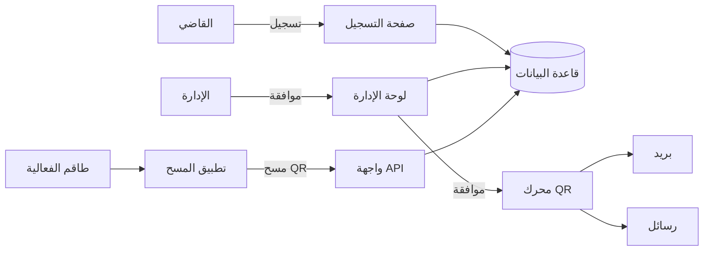

# Court Event Attendance

**Repository:** `court-event-attendance` — Judge event attendance registration for Court of Cassation events (اليوبيل الذهبي and similar).

نظام تسجيل حضور القضاة والنيابة لفعاليات محكمة النقض — يشمل صفحة تسجيل عامة، لوحة إدارة، توليد QR، وإرسال إشعارات، وتطبيق جوال للمسح.

## Architecture



## URLs

- **[BUSINESS_GUIDE.md](./BUSINESS_GUIDE.md)** — دليل الأعمال، الروابط، وبيانات الدخول ([court-events.flagshipfintech.com](https://court-events.flagshipfintech.com))
- **[URLS.md](./URLS.md)** — full technical URL list (admin, API, mobile)

## GitHub

Repository name: **`court-event-attendance`**

After [GitHub CLI](https://cli.github.com/) login (`gh auth login`), push from the project root:

```bash
gh repo create court-event-attendance --public --description "Judge event attendance registration for Court of Cassation" --source=. --remote=origin --push
```

Or create the repo on github.com, then:

```bash
git remote add origin https://github.com/YOUR_USERNAME/court-event-attendance.git
git push -u origin main
```

## Project structure

| Folder | Purpose |
|--------|---------|
| `web/` | Next.js — registration page, admin dashboard, APIs |
| `mobile/` | Expo — QR scanner for event staff (offline sync) |
| `assets/` | Branding (Golden Jubilee logo) |

## Quick start

### 1. Web application

```bash
# From project root — start PostgreSQL
docker compose up -d

cd web
cp .env.example .env
npm install
npm run db:setup    # migrate + seed
npm run dev
```

Open:

- Registration (demo): http://localhost:3000/register/golden-jubilee-2026
- Admin login: http://localhost:3000/admin/login

**Default accounts** (password: `Admin@123`):

| Email | Role |
|-------|------|
| admin@court.local | System Administrator |
| manager@court.local | Approval Manager |
| staff@court.local | Event Staff (mobile app only) |

### 2. Mobile scanner

```bash
cd mobile
cp .env.example .env
# Set EXPO_PUBLIC_API_URL to your machine IP (not localhost) on a real device
npm install
npx expo start
```

Log in with `staff@court.local` / `Admin@123`, select the event, and scan approved QR codes.

## Features implemented

### Registration (FR-01 – FR-06)
- Per-event public URL: `/register/[slug]`
- Arabic RTL form with required fields, rank/entity dropdowns
- Email and Egyptian mobile validation
- Duplicate prevention (email or mobile per event)
- Confirmation message after submission

### Admin dashboard (FR-07 – FR-12)
- Event creation with auto-generated registration links
- Registration list with filters (event, status, rank, entity)
- Approve / reject workflow
- Excel and CSV export

### QR & notifications (FR-13 – FR-16)
- Unique single-use QR token per approved registration
- Email via [Resend](https://resend.com) (configure `RESEND_API_KEY`, `EMAIL_FROM`)
- SMS via Twilio (optional: `TWILIO_*` env vars)
- QR invalidated after successful scan

### Mobile app (FR-17 – FR-21)
- Staff JWT authentication
- QR scanning with green/red feedback (haptics + vibration)
- Offline queue with sync when connectivity returns
- Event selection for wrong-event detection

## Environment variables (web)

See `web/.env.example` for all options. Minimum:

```
DATABASE_URL="file:./prisma/dev.db"
AUTH_SECRET="long-random-secret"
STAFF_JWT_SECRET="another-random-secret"
NEXT_PUBLIC_APP_URL="http://localhost:3000"
```

For production, use PostgreSQL (`provider = "postgresql"` in Prisma) and HTTPS.

## Admin features (new)

| Page | Path | Description |
|------|------|-------------|
| Users | `/admin/users` | Create, disable, reset passwords |
| Notifications | `/admin/settings` | Resend/Twilio status + test send |

## Deployment & mobile builds

See **[DEPLOYMENT.md](./DEPLOYMENT.md)** for:

- Vercel + Neon PostgreSQL
- Railway deployment
- Resend / Twilio configuration
- EAS production iOS/Android builds

```bash
./scripts/deploy-vercel.sh   # after vercel login + env vars
./scripts/deploy-railway.sh  # after railway login + Postgres plugin
cd mobile && eas build --profile production --platform all
```

## Production notes

- **NFR-03**: Deploy behind HTTPS (Vercel, Railway, etc.)
- **NFR-05**: Role-based access — Admin, Approval Manager, Event Staff
- **NFR-06**: PostgreSQL retention; configure backups for 3+ year policy
- **NFR-07**: Arabic RTL across registration and admin UI

## API reference (mobile)

| Endpoint | Method | Auth |
|----------|--------|------|
| `/api/mobile/login` | POST | — |
| `/api/mobile/scan` | POST | Bearer staff JWT |

## License

Private — Hennawy / Court of Cassation event project.
