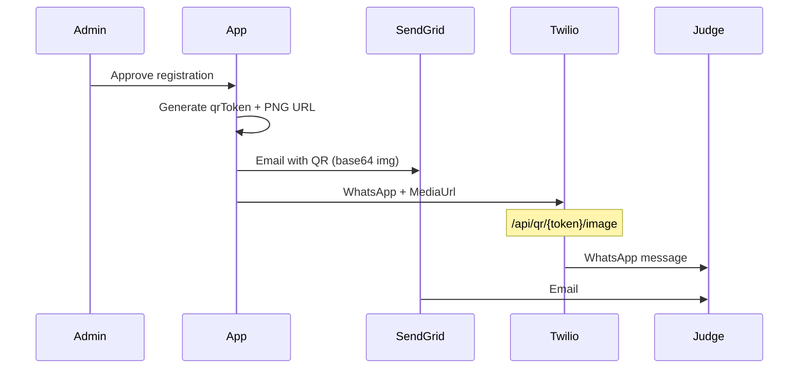

# Twilio integration guide — Email (SendGrid) + WhatsApp + QR

This app sends the attendance QR code when an admin **approves** a registration:

| Channel | Provider | What the judge receives |
|---------|----------|-------------------------|
| **Email** | **Twilio Email API** (`TWILIO_ACCOUNT_SID` + `TWILIO_AUTH_TOKEN`) or SendGrid / Resend | HTML email with embedded QR image |
| **WhatsApp** | Twilio Messaging API | Arabic message + QR image (PNG URL) |
| **SMS** | Twilio (optional) | Text + link to QR payload |

---

## Architecture



**Public QR image URL** (required for WhatsApp media):

`https://YOUR_APP_URL/api/qr/{qrToken}/image`

Example: `https://court-events.flagshipfintech.com/api/qr/QR-abc123.../image`

---

## Step 1 — Twilio account

1. Sign up: https://www.twilio.com/try-twilio  
2. Console: https://console.twilio.com  
3. Copy from the dashboard:
   - **Account SID** → `TWILIO_ACCOUNT_SID`
   - **Auth Token** → `TWILIO_AUTH_TOKEN`

---

## Step 2 — Email (Twilio Account SID + Auth Token)

The app uses the **Twilio Email API** when `TWILIO_ACCOUNT_SID`, `TWILIO_AUTH_TOKEN`, and `EMAIL_FROM` are set (same credentials as WhatsApp).

### 2.1 Verify a sender in Twilio Console

1. Twilio Console → **Email** → **Sender Identities**  
2. Add and verify a **domain** or **single sender**  
3. Use that address in `EMAIL_FROM`

### 2.2 Environment variables (recommended)

```env
TWILIO_ACCOUNT_SID=ACxxxxxxxx
TWILIO_AUTH_TOKEN=xxxxxxxx
EMAIL_FROM="Court Attendance <noreply@yourdomain.com>"
```

No separate SendGrid API key is required for this path.

### 2.3 Optional fallbacks

**SendGrid API key** (legacy):

```env
SENDGRID_API_KEY=SG.xxxxxxxxxxxxx
EMAIL_FROM="Court Attendance <noreply@yourdomain.com>"
```

**Resend**:

```env
RESEND_API_KEY=re_xxxxx
EMAIL_FROM="Event <onboarding@resend.dev>"
```

Priority: **Twilio Email** (SID + token) → SendGrid key → Resend key.

---

## Step 3 — WhatsApp (Twilio)

### 3.1 Sandbox (testing — ~15 minutes)

1. Console → **Messaging** → **Try it out** → **Send a WhatsApp message**  
2. Note the sandbox number, e.g. `+1 415 523 8886`  
3. From **your** WhatsApp, send the join message to that number (shown in console, e.g. `join abc-def`)  
4. Set env:

```env
TWILIO_WHATSAPP_NUMBER=whatsapp:+14155238886
```

Use the exact sandbox number from your console (with `whatsapp:` prefix).

5. Judges must **also join the sandbox** before they can receive messages, OR you add their numbers as allowed recipients in sandbox settings.

### 3.2 Production WhatsApp

1. Apply for **WhatsApp Business** via Twilio (Meta approval required)  
2. Register message **templates** in Arabic (required for outbound messages outside 24h session)  
3. Use your approved WhatsApp sender:

```env
TWILIO_WHATSAPP_NUMBER=whatsapp:+20XXXXXXXXXX
```

4. For template-based flows, extend `sendQrWhatsApp` in `web/src/lib/notifications.ts` to use Content SID — contact your Twilio rep for template approval.

### 3.3 Egyptian mobile numbers

Stored format in DB: `+201xxxxxxxxx` (app normalizes on registration).

WhatsApp `To` address: `whatsapp:+201xxxxxxxxx`

---

## Step 4 — Optional SMS

SMS is sent only if:

- `TWILIO_PHONE_NUMBER` is set, **and**
- `TWILIO_WHATSAPP_NUMBER` is **not** set, **or** `NOTIFY_SMS=true`

```env
TWILIO_PHONE_NUMBER=+1xxxxxxxxxx
NOTIFY_SMS=true
```

Buy an SMS-capable number in Twilio → Phone Numbers.

---

## Step 5 — Configure Vercel (production)

Vercel → **court-event-attendance** → Settings → Environment Variables → **Production**:

| Variable | Example |
|----------|---------|
| `TWILIO_ACCOUNT_SID` | `AC....` |
| `TWILIO_AUTH_TOKEN` | `....` |
| `EMAIL_FROM` | `Attendance <noreply@yourdomain.com>` |
| `SENDGRID_API_KEY` | optional fallback |
| `TWILIO_WHATSAPP_NUMBER` | `whatsapp:+14155238886` |
| `TWILIO_PHONE_NUMBER` | optional |
| `NOTIFY_SMS` | `false` |
| `NEXT_PUBLIC_APP_URL` | `https://court-events.flagshipfintech.com` |

Redeploy after saving (or push to `main` — Git deploy will pick up env).

CLI:

```bash
cd web
vercel env add SENDGRID_API_KEY production
vercel env add TWILIO_WHATSAPP_NUMBER production
# ... repeat for each variable
```

---

## Step 6 — Test from admin panel

1. Open https://court-events.flagshipfintech.com/admin/settings  
2. Login as `admin@court.local`  
3. Check status badges (email / WhatsApp / SMS)  
4. **Send test** per channel:
   - Email → your inbox  
   - WhatsApp → `+20xxxxxxxxxx` (sandbox-joined number)  
   - SMS → `+20xxxxxxxxxx`

5. Approve a real **pending** registration and confirm judge receives email + WhatsApp.

---

## Step 7 — Local development

`web/.env`:

```env
NEXT_PUBLIC_APP_URL=http://localhost:3000
TWILIO_ACCOUNT_SID=AC...
TWILIO_AUTH_TOKEN=...
EMAIL_FROM="Court Attendance <noreply@yourdomain.com>"
TWILIO_WHATSAPP_NUMBER=whatsapp:+14155238886
```

Run:

```bash
cd web && npm run dev
```

> WhatsApp **media** requires a **public HTTPS** URL. Localhost images will not work for WhatsApp media in production flow; use Vercel preview or ngrok for full WhatsApp+image tests.

---

## Troubleshooting

| Issue | Fix |
|-------|-----|
| Email not sent | Verify **Twilio Email** sender identity; check `EMAIL_FROM` matches verified domain |
| `Invalid value for field 'from'` | `EMAIL_FROM` must be an address on a **verified** Twilio Email domain (no `@resend.dev`); fix typos in domain; use only one `EMAIL_FROM` in `.env` |
| `TWILIO_ACCOUNT_SID` starts with `SK` | Use **Account SID** (`AC…`) from the Twilio Console dashboard, not an API Key SID |
| WhatsApp 63016 / sandbox | Recipient must send `join ...` to sandbox number |
| WhatsApp media failed | Ensure `NEXT_PUBLIC_APP_URL` is public HTTPS; open `/api/qr/{token}/image` in browser |
| 21608 invalid From | `TWILIO_WHATSAPP_NUMBER` must include `whatsapp:` prefix |
| Duplicate SMS + WhatsApp | Set `NOTIFY_SMS=false` when using WhatsApp only |
| Egypt number fails | Use E.164: `+201xxxxxxxxx` |

---

## Code reference

| File | Purpose |
|------|---------|
| `web/src/lib/notifications.ts` | SendGrid, Resend, WhatsApp, SMS |
| `web/src/lib/twilio-client.ts` | Twilio REST helper |
| `web/src/lib/approval.ts` | Triggers all channels on approve |
| `web/src/app/api/qr/[token]/image/route.ts` | Public PNG for WhatsApp |
| `web/src/app/admin/settings/page.tsx` | Test UI |

---

## Security

- Never commit `.env` or API keys to GitHub  
- Rotate Twilio Auth Token if exposed  
- Restrict SendGrid API key to Mail Send only  
- Use Vercel encrypted env vars in production
